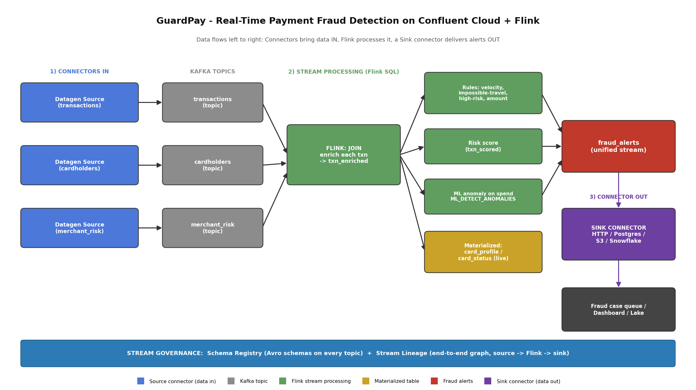

# GuardPay — Real-Time Payment Fraud Detection on Confluent Cloud + Flink

GuardPay scores card payments and flags fraudulent transactions the moment they happen, instead of finding fraud later in a next-day report. It runs entirely as streaming SQL on Confluent Cloud. There are Connectors available in Confluent - these connectors help you to fetch live data from stream . IN this scenario, I have tried to simulate a card transaction system where there would be m,ultiple card transacations that are populated. The Connectors bring in a live stream of card transactions plus reference data for cardholders and merchant risk. THe Merchant Risk is generated from sample schemas for this demo. 
Using Apache Flink, I created tables that join each transaction to the cardholder and merchant risk, keep a rolling per-card profile, and assign a fraud risk score using both rules (velocity, impossible travel, high-risk merchant, large amounts) and a built-in anomaly check on spend. 

A sink connector pushes the alerts out to a downstream system. Every stream is governed by Schema Registry and the whole flow is visible in Stream Lineage.

The final output can be linked to any system in real-time and automatic alerting can be triggered accordingly.

## What it does

- Ingests a live stream of card transactions plus two reference streams (cardholders and a merchant risk list).
- Flink is used to enrich each transaction that keeps a rolling per-card profile, and apply several fraud signals at once:
  - velocity (too many transactions on one card in a short window),
  - impossible travel (transactions from different countries within minutes),
  - high-risk merchant and large-amount rules,
  - an anomaly score on the card's own spend using Flink's built-in ML function.
- Combines rule hits and high scores into one `fraud_alerts` stream and sinks it out (HTTP webhook, Postgres, S3, or Snowflake).
- Keeps a live `card_status` view — the current state of every card — for a dashboard.
- Since this is demo application, the transactions, card details etc are sample one (generated at random but follow a pattern)

## Architecture



```
transactions ─┐
cardholders  ─┤ (Flink JOIN) → txn_enriched ─┬─ rules → rule_hits ─┐
merchant_risk─┘                              ├─ ML_DETECT_ANOMALIES → ml_hits ┼─ fraud_alerts → SINK → webhook / DB / lake
                                             ├─ risk score → txn_scored ──────┘
                                             └─ hopping window → card_profile / card_status
```

## Repo layout

```
guardpay-fraud-detection/
├── README.md                     # this file
├── .gitignore
├── setup/
│   └── README.md                 # step-by-step build instructions (Confluent Cloud UI)
├── flink/
│   └── guardpay.sql              # all Flink SQL, in order
├── connectors/
│   ├── datagen-transactions.json # connector settings for reference (set up in the UI)
│   ├── datagen-cardholders.json
│   ├── datagen-merchant-risk.json
│   └── http-sink-fraud-alerts.json
├── schemas/
│   ├── transactions.avsc         # custom Avro schemas the datagen sources use
│   ├── cardholders.avsc
│   └── merchant_risk.avsc
└── docs/
    └── architecture.png
```

## How to run it

You need a Confluent Cloud account. Everything is done in the web console — no CLI required.

Full step-by-step instructions are in [`setup/README.md`](setup/README.md). In short:

1. Create an environment (with Stream Governance Essentials) and a Basic Kafka cluster.
2. Create the topics `transactions`, `cardholders`, `merchant_risk`.
3. Add three Datagen Source connectors (one per topic) using the Avro schemas in `schemas/`.
   Let each connector create its own credentials, and use AVRO output.
4. Create a Flink compute pool, open the workspace, and run `flink/guardpay.sql` in order.
5. Add a sink connector on the `fraud_alerts` topic to deliver alerts out.
   I used an HTTP webhook (webhook.site) because it is the quickest way to see alerts arrive and to
   get a Stream Lineage screenshot. The webhook can be swapped for any of these without changing the
   rest of the pipeline: a Postgres/JDBC sink (alerts become rows in a `fraud_cases` table), an
   Amazon S3 sink (alerts land as files for audit/BI), or a Snowflake sink (alerts land in a table
   for analytics). Use JSON for the webhook; use Avro for the Postgres/S3/Snowflake sinks.
6. Open Stream Lineage to see the end-to-end graph, then clean up the resources.

## Notes

- The datagen sources use custom Avro schemas (in `schemas/`) so the transaction stream looks like
  real card activity. In production these would be a payments CDC/HTTP source and a JDBC source for
  reference data.
- The anomaly detection uses Flink's built-in `ML_DETECT_ANOMALIES` function, so there is no model
  to train or host. If it isn't available, the rule engine and risk score alone still produce
  alerts.
- The connector JSON files under `connectors/` are for reference — set the connectors up in the UI.
  No secrets are stored in this repo.

## Tech

Confluent Cloud (Kafka, managed connectors, Stream Governance / Schema Registry, Stream Lineage) and
Apache Flink SQL.

Feel free to reuse this. Built by Sridhar.
